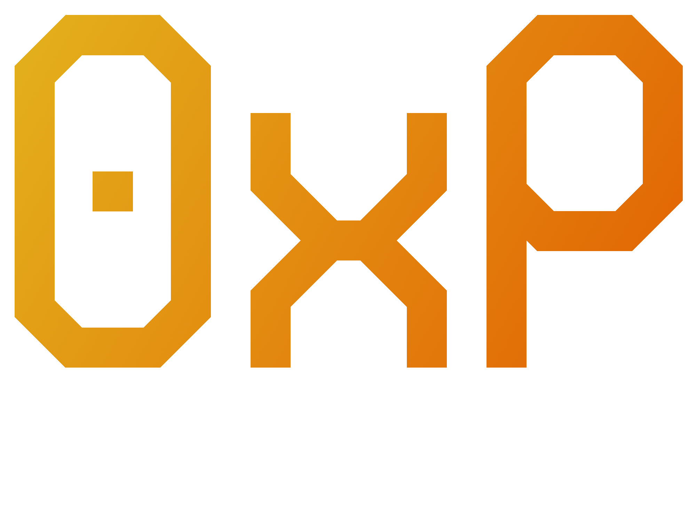
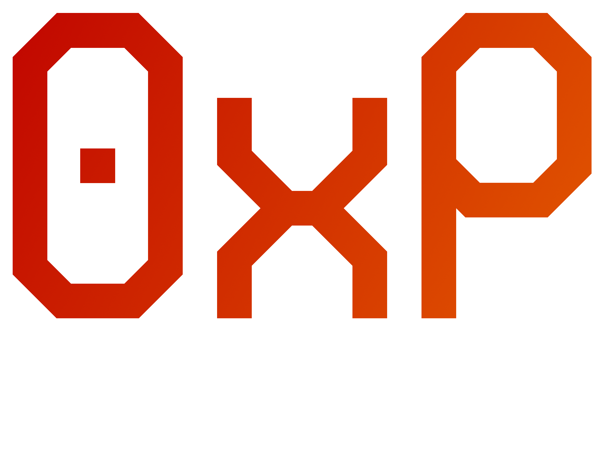

A blockchain based supply chain management system built with Solidity and React. Use 0xP Material to document raw materials, 0xP Fabricate to record manufacturing components and BOMs, and use 0xP Transport to handle shipping.

<table align="center" style="border: none; width: 100%;">
    <tr>
        <td style="width:33%; padding: 8%;"></td>
        <td style="width:33%; padding: 8%;"></td>
        <td style="width:33%; padding: 8%;"></td>
    </tr>
</table>

## Prerequisites
* Node.js installed
* NPM (Node Package Manager) installed
* Metamask

## Setup
### Installation
* Run `git clone -b release https://github.com/fdcoull/0xPipeline.git`
* Run `npm install`
* In the root directory, create an .env file.
* Run `npx hardhat compile`

### Virtual Blockchain
* Run `npx hardhat node`
* Keep this running as it is required for deploying contracts and accessing them.

### Deploy Contracts
* Run `npx hardhat ignition deploy ignition/modules/MaterialControl.js --network localhost`
* Run `npx hardhat ignition deploy ignition/modules/FabricateControl.js --network localhost`
* Run `npx hardhat ignition deploy ignition/modules/TransportControl.js --network localhost`
* Run `npx hardhat ignition deploy ignition/modules/Pipeline.js --network localhost`
* Run (optional sample contracts) `npx hardhat ignition deploy ignition/modules/SampleData.js --network localhost`
* Copy each of the deployed addresses from the output into the .env file, using the following format:

`REACT_APP_MATERIAL_CONTROL_ADDRESS=`  
`REACT_APP_FABRICATE_CONTROL_ADDRESS=`  
`REACT_APP_TRANSPORT_CONTROL_ADDRESS=`  
`REACT_APP_PIPELINE_ADDRESS=`  

### Set Metamask to Hardhat Network
* Open Metamask
* Select dropdown at top right to change network > Add Custom Network
* Fill in details (For virtual blockchain):
    - Network Name: Hardhat
    - Default RPC URL: http://127.0.0.1:8545
    - Chain ID: 31337
    - Currency Symbol: ETH
* Now from Metamask Home > Account Dropdown > Add Account > Import Account
* On Hardhat's virtual blockchain it's recommended to use the first PRIVATE key that is output from your running instance of `npx hardhat node`
* Click Import
* Select the newly imported account
* If a virtual balance doesn't appear (balance stays at 0), restart your browser

### React Frontend
* Run `npm run start`
* Keep this running as it is required for viewing the web app.
* Follow the url returned by this command on your browser.

## Instructions
### General
* Following the link provided by `npm run start` will take you to the home page.
* From here, select either Material, Fabricate, or Transport depending on your requirements.
* Initially you will need to login by clicking the user icon at the top right.
* Click on login, login to metamask, and you will see your public address show at the bottom of the page as well as on the navbar next to the user icon.

### Material
* Materials
    - Materials appear on the home page
    - New materials can be listed via the List Material button
    - Batches can be added via the Add Batch button
* Orders
    - Contains list of orders from your Material contract
    - Manually create an order by clicking Add Order

### Fabricate
* Parts
    - A list of your parts will appear on the main page
    - Add new parts by clicking Add Part
* BOMs
    - Bills of Materials appear on this page
    - Create a new BOM by clicking add BOM
    - Clicking on a BOM row will show the list of each BOM's components
* Products
    - The products on this page are created when you create a BOM, with an initial stock of 0
    - Create a product by clicking Manufacture Product, this will increase product stock and decrease part stock by BOM components 
* Orders
    - Contains list of orders from your Fabricate contract
    - Manually create an order by clicking Add Order

### Transport
* Shipments
    - Contract shipments are listed on the main page
    - Create a new shipment by clicking Add

### Account - Providers
Navigate to Account to view your saved suppliers or add to your list. These are other suppliers, fabricators, and carriers that have implemented the 0xPipeline system. Each type of organisation can be added by clicking the respective Add button and adding a contract address for one of your contacts.  

* Material Providers
    - Catalogs of your saved Material providers are presented on this page
    - From here you can click Buy to submit an order and the item will be added to your Fabricate parts inventory

* Fabricate Providers
    - Catalogs of your saved Fabricate providers will appear here
    - Similar to above, you can click Buy to create an order

* Transport Providers
    - A list of unshipped orders will appear here and underneath, a list of orders that have been shipped and by which Transport contract
    - From here, click Ship next to an unshipped order to begin the shipping process where you can choose a courier and shipping method

## Changelog
### 1.3.2
* Fixed Material test
* Fixed Fabricate test

### 1.3.1
* Added admin link to home
* Fixed home positioning
* Fixed admin page loading issue
* Added refresh buttons
* Updated instructions

### 1.3.0
* Added transport provider view
* Added transport provider shipping

### 1.2.0
* Added fabricate provider view
* Added fabricate provider purchases 

### 1.1.0
* Added providers to pipeline contract
* Added pipeline deploy script
* Added provider list to admin
* Added increase part stock function to fabricate contract
* Added material provider view
* Added material provider purchases

### 1.0.0
* Add part fabricate feature added
* Manufacture product fabricate feature added
* Add order fabricate feature added
* Add BOM fabricate feature added
* Initial full release

### 0.13.0
* Added list material feature
* Added add batch material feature
* Added order material feature

### 0.12.0
* Added hamburger indicator to fabricate BOM view
* Added documentation to README
* Added transport add shipment feature

### 0.11.0
* Added fabricate deploy script
* Fixed fabricate contract issue
* Added fabricate parts view
* Added fabricate products view
* Added fabricate orders view
* Added fabricate boms view

### 0.10.0
* Added transport deploy script
* Fixed transport contract issue
* Added transport view

### 0.9.0
* Added material count to contract
* Added material deploy script
* Added contract read functionality
* Added material view
* Added material orders view

### 0.8.0
* Dotenv installed
* Removed Lock default ignition file
* Add contract ABIs
* Added metamask connection
* Added login system to accounts page
* Add env reference for Material Control Address

### 0.7.0
* Fixed navbar link
* Added page menus
* Added toolbar

### 0.6.0
* React Bootstrap installed
* Bootstrap Icons installed
* Remove react default logos
* Added favico
* Bootstrap navbar added
* Account page added

### 0.5.0
* Remove Lock contract
* Remove Test contract
* Frontend structure defined
* Components and pages added
* Navbar component added
* Home page created
* Material page created
* Fabricate page created
* Transport page created

### 0.4.0
* Added logo to readme
* Transport control added
* Transport control tested

### 0.3.0
* Fabricate control added
* Fabricate control tested

### 0.2.0
* Materials control added
* Materials control tested

### 0.1.0
* Hardhat installed
* React installed
* Ethers installed
* Tests set up
